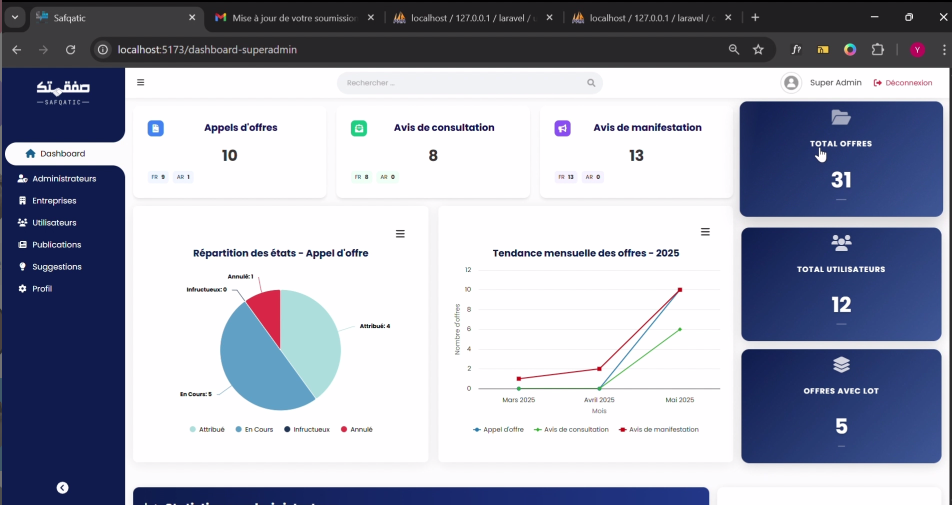
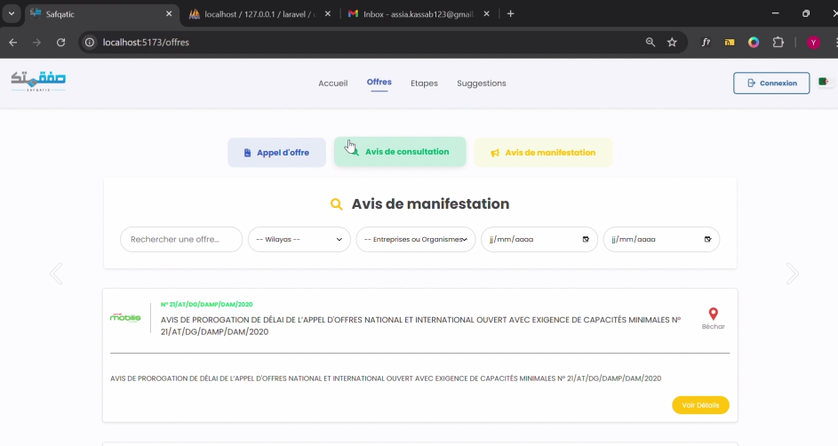
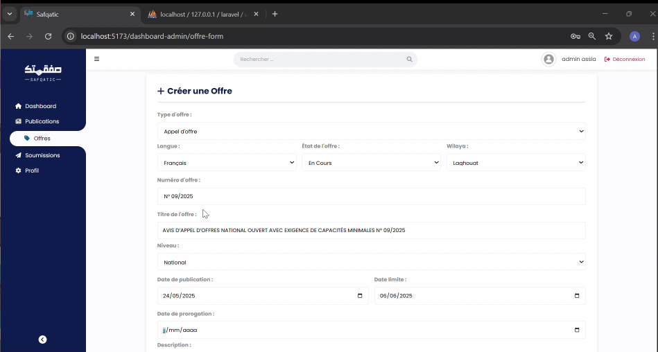

# Safqatic Plateforme de Gestion d'Appels d'Offres

> Projet de Fin d'Études (Licence) — Plateforme web permettant la publication, la consultation et la soumission d'appels d'offres publics/privés, avec gestion multi-rôles et tableau de bord statistique.

  
   
  

## 🎯 Contexte

Safqatic centralise la gestion des offres et soumissions entre entreprises et administrations : publication d'appels d'offres, dépôt de soumissions, suivi de leur statut, et pilotage via un dashboard statistique. Le projet gère trois niveaux d'accès (utilisateur, admin, super-admin) avec des permissions distinctes.

## ✨ Fonctionnalités principales

- **Authentification multi-rôles** : inscription/connexion utilisateur, admin et super-admin, avec vérification d'email et reCAPTCHA
- **Gestion des offres** : création, recherche/filtrage, consultation détaillée
- **Soumissions** : dépôt de dossiers par les entreprises, suivi d'état (en cours, acceptée, rejetée)
- **Favoris & notifications** : sauvegarde d'offres, alertes en temps réel
- **Dashboard statistique** : visualisation des données (Highcharts, Chart.js) pour le suivi administratif
- **Interface bilingue** français / arabe (vue-i18n)
- **Gestion des utilisateurs** côté super-admin (validation, suppression)

## 🛠️ Stack technique

| Couche | Technologies |
|---|---|
| Frontend | Vue 3, Vite, Ionic Vue, Highcharts, Chart.js, Axios, vue-i18n |
| Backend | Laravel (PHP), Sanctum (auth API), MySQL |
| Autres | reCAPTCHA, vérification d'email par token signé |

## 📁 Structure du projet

```
PFE-Final/
├── frontend/    # Application Vue 3 (SPA)
└── backend/     # API REST Laravel
```

## 🚀 Installation

### Backend
```bash
cd backend
composer install
cp .env.example .env
php artisan key:generate
php artisan migrate
php artisan serve
```

### Frontend
```bash
cd frontend
npm install
npm run dev
```

L'application frontend consomme l'API définie par `VITE_API_URL` dans `frontend/.env`.

## 📌 Notes techniques

- Authentification API via Laravel Sanctum (tokens)
- Séparation stricte des routes par rôle via middleware `auth:sanctum`
- Support i18n complet (FR/AR) avec bascule de langue à la volée

## 🔭 Pistes d'amélioration

- Tests automatisés (PHPUnit côté backend, Vitest côté frontend)
- Pagination/optimisation des requêtes sur les listes d'offres volumineuses
- Déploiement CI/CD

---
*Projet réalisé dans le cadre de la Licence en Ingénierie des Systèmes d'Information et Logiciel.*
